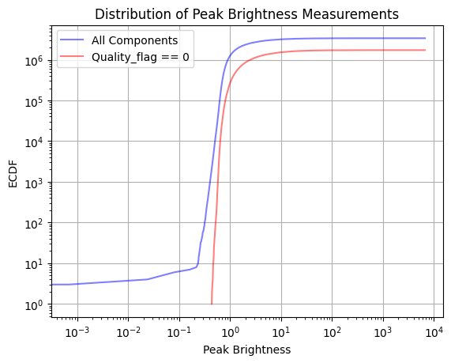

# Mining VLASS data for transients

The Very Large Array Sky Survey (VLASS, https://science.nrao.edu/vlass) is a synoptic survey of the 33,885 square degrees of the radio sky in the 2 to 4 GHz frequency range. This repository focuses on analyzing the epoch1 data from the VLASS survey to identify and study transients.

## Insights from Epoch 1 Data

During the analysis of the epoch1 data from the VLASS survey, the following insights were obtained:

1. [Insight 1]: Description or summary of the first insight.
   

2. [Insight 2]: Description or summary of the second insight.
   

3. [Insight 3]: Description or summary of the third insight.
   

## Google Colab Notebook

To explore the VLASS data and perform further analysis, you can use the Google Colab notebook available in this repository. Simply click the following link to open the notebook in Google Colab:

## Getting Started

To get started with the project, follow these steps:

1. [Step 1]: Description of the first step to set up the project.
2. [Step 2]: Description of the second step to install dependencies.
3. [Step 3]: Description of the third step to run the analysis scripts.

## Repository Structure

- `data/`: Directory containing the VLASS epoch1 data files.
- `scripts/`: Directory containing the analysis scripts.
- `images/`: Directory containing images for the insights.
- `README.md`: This file providing an overview of the project.

## License

This project is licensed under the MIT Licence. See the LICENSE file for more details.

## Contributing

Contributions are welcome! If you have any suggestions, bug reports, or feature requests, please create an issue or submit a pull request.

## Contact

For any inquiries or questions, feel free to reach out to vivekjyoti bhowmik at darkandpure.vb@gmail.com.
