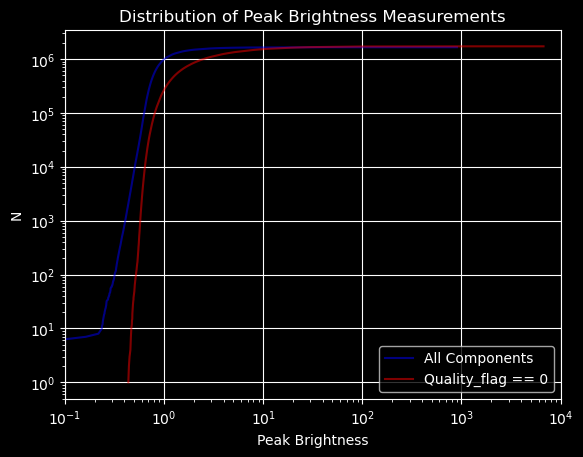
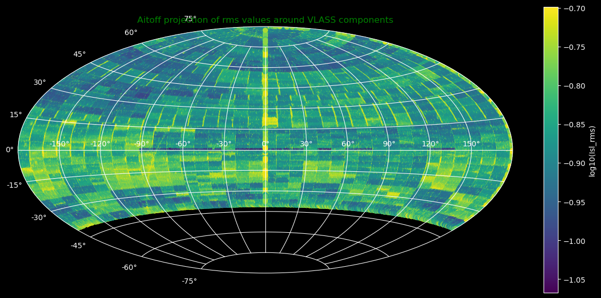
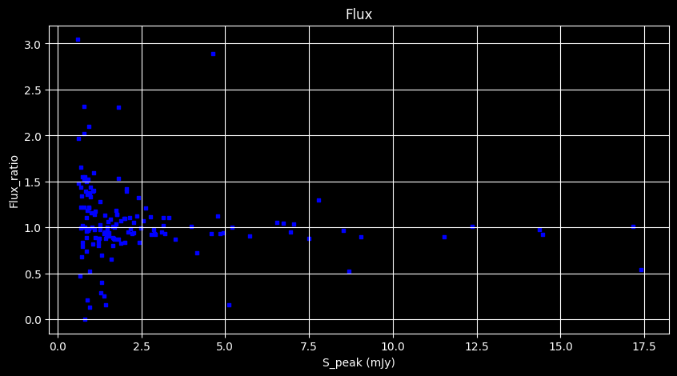
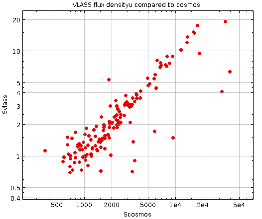
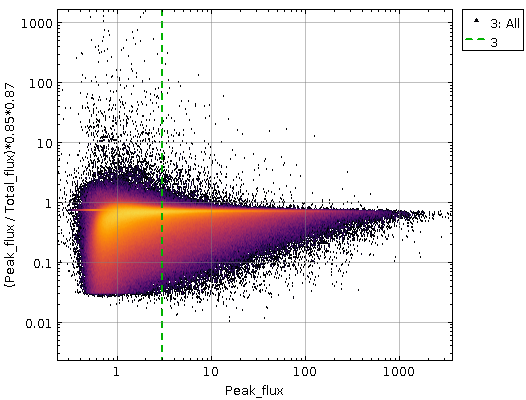

# Mining VLASS data for transients

The Very Large Array Sky Survey (VLASS, https://science.nrao.edu/vlass) is a synoptic survey of the 33,885 square degrees of the radio sky in the 2 to 4 GHz frequency range. This repository focuses on analyzing the epoch1 data from the VLASS survey to identify and study transients.

## Insights from Epoch 1 Data

During the analysis of the epoch1 data from the VLASS survey, the following insights were obtained:

### Insight 1 :  All components with vs without Qualtity flag(QF) == 0
- Flagged distribution shows a reduced no of faint detections.
- Distribution of all deviates from the flagged peak brightness by 5mJy/beam.
   

### Insight 2 :Aitoff projection in equatorial (J2000) coordinates of the rms values found around all VLASS components

- For clarity only Isl rms < 200 µJy/beam are shown and on a log10 scale. Additionally this is limited to components with Quality flag == 0 and Duplicate flag <= 2
- From this plot it is clear that the depth of the Quick Look imaging is not homogeneous.
- Key features in this plot include the Galactic plane at low Galactic longitudes, the checker-board pattern at southern latitudes, high noise at the East-West boundaries of tiles, and a region of high noise at DEC ∼ +85 in the Western hemisphere (12 < RA < 24 hr).
   

 ### Insight 3 :Comparission to the vlass/cosmos flux ratio vs peak flux of vlass

- shows deviation of flux betwn both 
 - median value is 0.95
 - below 3 mJy a scatter can be seen

   

   ### Insight 4 :Comparission to the vlass flux density vs flux density of vlass

   

 
 
 ### Insight 5 :The ratio of VLASS peak brightness to total flux density as a function of peak brightness

   

   

## Google Colab Notebook

To explore the VLASS data and perform further analysis, you can use the Google Colab notebook available in this repository. Simply click the following link to open the notebook in Google Colab:

## Getting Started

To get started with the project, follow these steps:

1. [Step 1]: Description of the first step to set up the project.
2. [Step 2]: Description of the second step to install dependencies.
3. [Step 3]: Description of the third step to run the analysis scripts.

## Repository Structure

- `data/`: Directory containing the VLASS epoch1 data files.
- `scripts/`: Directory containing the analysis scripts.
- `images/`: Directory containing images for the insights.
- `README.md`: This file providing an overview of the project.

## License

This project is licensed under the MIT Licence. See the LICENSE file for more details.

## Contributing

Contributions are welcome! If you have any suggestions, bug reports, or feature requests, please create an issue or submit a pull request.

## Contact

For any inquiries or questions, feel free to reach out to vivekjyoti bhowmik at darkandpure.vb@gmail.com.
